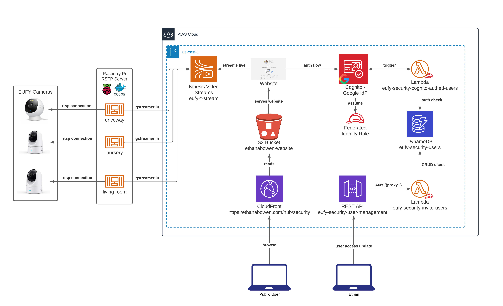

# EUFY Kinesis RSTP Integration

**Hypothesis**:

Using AWS and open source libraries, I can stream and host my EUFY Camera(s) footage cheaper than Eufy's $3/month rate.

**Process**:

Using AWS as a NAS (Network Attached Storage) proxy, I discovered a serverless Kinesis solution.
By using gstreamer, an open-source video processing library, I was able to take input of a EUFY camera's feed (via Real Time Streaming Protocol) and send it in real-time to AWS.

---

**Outcome**:

The full implementation (including website with domain) was cheaper per camera per month than what Eufy costs.

Cost per camera per month (bytes in/storage): **~$1.50**

Pros:

- Ownership of camera data
- Custom retention policy
- Cheaper

Cons:

- May not be cheaper at scale
- Continuous streaming is more expensive than event streaming

---

:rocket: **Future**:

- Test lower framerate impact on quality of experience and cost savings
- Add event recording and play backonly.
  - Large cost savings benefits, would allow for large scability.
- Setup access control to specific cameras and for limited duration.
- Investigate setting this up with an IoT mindset.
- Resolve STS token session refresh
- CloudWatch alarm on camera/streaming failure of any kind.
- Turn off verbose logging

---

## Tech Stack (processing):

- Docker - containerized deployment for scability across cameras
- Python - integration video library with camera feed
- [gstreamer](https://docs.aws.amazon.com/kinesisvideostreams/latest/dg/examples-gstreamer-plugin.html) - video library
- AWS
  - Kinesis Video Stream - serverless Kinesis solution

# Architecture

# Files and Commands

## Processing

- `docker_build.sh` - build/update image with tag
- `docker-compose up` - spin up N containers pointing to image
- camera.py - receive video feed and send it to AWS Kinesis Video Streams (KVS)
- env_example.txt - example of env file. See docker-compose.yml for naming/config information

## Auth Controls

- lambdas/cognito-authed-users.js - Custom User access-control based on DynamoDB User table
- lambdas/dynamo-invite-user.js - CRUD for Users in DynamoDB
